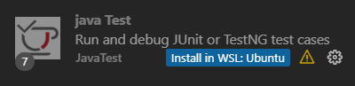

# Testing 

This week we will be focusing on using and creating tests to make sure that your code works as intended. 

### 💀 Deadline
This work should be completed before the exercise on **Friday 17 November**.

### 👩‍🏫 Instructions
For instructions on how to do and submit the assignment, please see the
[assignments section of the course instructions](https://gits-15.sys.kth.se/inda-23/course-instructions#assignments).

### 📝 Preparation

- Read and answer all questions in Module 9: [Testing](https://qbl.sys.kth.se/sections/dd1337_ht23_programmering_prog/container/testing)
- You can access the OLI material by
  1. logging in via Canvas (see the [OLI Torus SE](https://canvas.kth.se/courses/41415/external_tools/4247) link in the left menu)
  2. Then start reading [Testing](https://qbl.sys.kth.se/sections/dd1337_ht23_programmering_prog/container/testing)

**IMPORTANT NOTE:** In order to complete this week's assignment you must also be able to run unit tests on your computer.
You can run the unit tests either in the terminal or from your editor, following the guides below:

* **Install a new IDE:** Download and install IntelliJ IDEA ([download link](https://www.jetbrains.com/idea/download/)), an Integrated Development Environment (IDE). They offer free, educational licenses, so you can access their full suite. Choose this option if you want to avoid following online tutorials and managing configuration files. Have a look at [this YouTube tutorial](https://www.youtube.com/ watch?v=HU0Ittkjx4Y) to get started.
* **The old-school and hardcore way**: [Running JUnit4 from the command line](https://gits-15.sys.kth.se/inda-23/extra-reading-material/blob/master/testing/README.md)
* **Through VS Code:** Visual Studio Code also has [support for JUnit4](https://code.visualstudio.com/docs/java/java-testing),
      but unfortunately, we have not had the time to make a video tutorial of that. However, if you are using WSL, you should be able to download the WSL extensions in Visual Studio Code from [WSL](https://marketplace.visualstudio.com/items?itemName=ms-vscode-remote.remote-wsl). Then if you search for `"java test"` you should be able to find an extension with the option `Install in WSL: Ubuntu`. Click the blue link and wait for it to be installed. Then head to the `Testing` tab in VS Code and you should be able to enable Java tests using JUnit.
      
* **Through hardcore manual configuration of VS Code:** VS Code reads configuration settings in a hidden folder `.vscode`. You can manually add a `settings.json` file as described in [JUnit 4.12 in INDA](https://gits-15.sys.kth.se/inda-23/extra-reading-material/blob/master/testing/README.md)
      


> **Important:** We use **JUnit 4.12** in the INDA courses. Using later or
> earlier versions of JUnit most likely will not work with our test
> classes.

> **Important:** It can often be a bit difficult to get up and running with JUnit4. Make sure that you have tried 
> to run the provided test classes as early as possible, and if you can't  get it to work, make sure to follow 
> the steps of the 🚨 Troubleshooting Guide.

### ✅ Learning Goals
This week's learning goals include:

* Running JUnit tests
* Using failing test cases to identify and remedy bugs
* Writing unit tests
* Using test-driven development
* Refactoring code
* Optimizing code

### 🚨 Troubleshooting Guide
If you have any questions or problems, follow this procedure: <br/>

1. Look at this week's [posted issues](https://gits-15.sys.kth.se/inda-23/help/issues). Are other students asking about your problem?
2. If not, post a question yourself by creating a [New Issue](https://gits-15.sys.kth.se/inda-23/help/issues/new). Add a descriptive title, beginning with "Task *x*: *summary of problem here*"
3. Ask a TA in person during the [weekly lab](https://queue.csc.kth.se/Queue/INDA). Check your schedule to see when the next lab is.

We encourage you to discuss with your course friends, but **do not share answers**!

### 🏛 Assignment
You will probably have realized that writing good code that does exactly what you intended can be _hard_.
Even the best programmers have experienced that code that they thought was designed and written correctly still gives the 
wrong result. Even worse are [regressions](https://en.wikipedia.org/wiki/Software_regression), where a change you 
make somewhere in your program causes some other part to stop working. 

To detect and be able to solve problems like this, we have the field of [software testing](https://en.wikipedia.org/wiki/Software_testing).
Tests come in many shapes and forms, but a very common form is [unit tests](https://en.wikipedia.org/wiki/Unit_testing),
designed to test that a particular method or combination of methods works the way you want. 

From this point onwards, testing will be a vital component of the weekly tasks, and you will be asked to both create 
your own tests and run existing tests on your code before submitting your work. This mimics the way software development 
is often done in practice and can help you detect problems in your code

#### Exercise 9.0 -- Where's that bug?
In the [src](src) folder you can find a class called `Calculator`, which represents a very basic calculator that
can add, subtract, multiply, and divide. You can also find the test class `CalculatorTest`, which contains basic unit
tests for verifying that the program works as intended. 

Your first task is to run these unit tests, following the instructions in the 📝 Preparation section.
You should find that most test cases pass, but there is one failing test. Identify which method causes this issue
and fix the relevant code in the [`Calculator`](src/Calculator.java) class. Run the tests again to make sure everything
works correctly.

> **Assistant's note:** Don't remember how to throw exceptions? Have a look at
> [How to throw exceptions](https://docs.oracle.com/javase/tutorial/essential/exceptions/throwing.html)!

#### Exercise 9.1 -- Test driven development
You will soon be adding a new method to the `Calculator` class, but let's first write the test cases for this method.
This way of writing the tests before the actual program code is called 
[test-driven development](https://en.wikipedia.org/wiki/Test-driven_development), and can be very useful. By having 
the test cases in place before you start, you can see right away when your implementation is working. A potential issue
is the temptation to write the code just so that it passes those particular test cases. Remember that no test suite
can prove that your code is completely bug-free, and can only cover a limited amount of potential inputs.

Add four new test cases for an `inverse` method in `CalculatorTest`. This method takes no arguments since it only make use of the local field `value`,
and gives you the [multiplicative inverse](https://en.wikipedia.org/wiki/Multiplicative_inverse) of the current value
stored by the calculator. As an example, if the `value` is `10`, `inverse` should return `0.1` (_1/10_).

The tests should verify the following:
* `inverse` gives a correct result for positive values.
* `inverse` gives a correct result for negative values.
* `inverse` throws an `IllegalArgumentException` when the `value` is zero.
* Applying `inverse` twice should leave the value unchanged. That is, if `value` is `7`, the result of calling 
  the `inverse` method twice should set the value to _1 / (1/7) = 7_.

Take a look at the existing tests to get an idea of how you can write and name your test methods. 
You can read more about how to write tests for methods that should throw an exception below.

<details>
<summary> 📚 Testing for exceptions </summary>

Using JUnit, a very neat way of asserting an exception is like this:
```java
@Test(expected=IllegalArgumentException.class)
public void aSimpleTestWhereWeExpectAnException() {
    // Test code
}
```

An important thing to note here is that using this syntax to assert an
exception is only appropriate if your test consists of a single act (i.e. one
call to the method under `@Test`), and maybe some trivial arrangement that cannot
possibly throw an exception. If there is a complex arrangement and several different method calls,
the expected exception may be thrown in the _wrong_ place, so the test passes
even though it didn't do what you wanted it to. In the case where the test is
more complex, it is more appropriate to use a _try/catch_ like this:
```java
@Test
public void moreComplexTestInWhichWeExpectAnException() {
    // Possible arrangement code
    try {
        // The following method call should result in an exception
        someObject.someMethod();
        // If no exception is thrown, we fall through to this fail
        fail("Expected some exception!");
    } catch (SomeException e) {
        // Exception thrown, all good!
    }
    // Possible assert code
}
```

The tests you write for this task should be simple enough, so you may use the syntax of the first example without worry. 
</details>

#### Exercise 9.2 -- Implementing your method
Now that you have written the tests, it is time to actually implement the method. The method should have the header
```java
public double inverse()
```
Make sure that your method passes the tests you wrote earlier. If a test should fail, remember to also consider the 
possibility of a bug in your test code, as opposed to in the `inverse` method itself. 

> **Assistant's note:** The method should return the inverse based on the object's field `value` and update that same field accordingly inside the method. Be sure to also return the inverse as a double so that we easily can use a direct call to this method in our tests. 

#### Exercise 9.3 -- The Sieve of Eratosthenes
The [Sieve of Eratosthenes (Wikipedia link)](https://en.wikipedia.org/wiki/Sieve_of_Eratosthenes)
is a classic algorithm for finding out which numbers are [prime](https://en.wikipedia.org/wiki/Prime_number), 
and which are not. It does so by first assuming that all numbers are prime, and then, starting from 2 (the first prime),
marking all _multiples_ (i.e. 4, 6, 8, 10 etc) as _not_ prime, since a multiple of a prime is not a prime (apart from
multiplying with 1). After this, it finds the next number that is not a multiple of 2 (3 in this case). 
This number must be a prime since it's not a multiple of any smaller prime number, and so we can mark all multiples 
of 3 as not prime. The process then continues with 5, 7, and so on. The animation below is taken from the 
Wikipedia entry, and visually illustrates this process:


> [Image](https://commons.wikimedia.org/wiki/File:Animation_Sieve_of_Eratosth.gif)
> by Wikipedia user [SKopp](https://de.wikipedia.org/wiki/Benutzer:SKopp)

In this exercise, you will be given a working but not quite bulletproof implementation of the Sieve algorithm. 
Your task is to test it, fix the bugs, refactor it, and finally make an optimization. 

<details>
    <summary> 🛠 The sieve of Eratosthenes algorithm </summary>

The implemented algorithm looks like this and is available at [src/Sieve.java](src/Sieve.java):
```java
public boolean isPrime(int number) {
    boolean[] prime = new boolean[number + 1]; // + 1 because of 0-indexing
    Arrays.fill(prime, true); // Assume all numbers are prime
    int sqrt = (int) Math.floor(Math.sqrt(number));
    for (int i = 2; i <= sqrt; i++) {
        if (prime[i]) {
            for (int j = i*2; j < prime.length; j += i) {
                prime[j] = false; // Mark multiples of i as not prime
            }
        }
    }
    return prime[number];
}
```
</details>

Take some time to read through the code, look at the animation and the description and try to get a 
rough idea of how the algorithm works. A **JUnit4** test class with a few tests has also been provided at 
[src/SieveTest.java](src/SieveTest.java), and the type of each test (e.g. negative, positive, boundary) is noted.

Once you feel that you have some understanding of the code, let's move on to implementing more tests.
In the `SieveTest` class, there are only positive tests, which test valid inputs. But what happens if we pass
values that are not even reasonable to consider for prime status? Implement two tests, `isPrimeExceptionWhenNumberIsOne` 
(_negative border test_) and `isPrimeExceptionWhenNumberIsMinusTen` (_negative test_), that asserts that `isPrime`
throws an `IllegalArgumentException` when passed `1` and `-10` respectively. 

#### Exercise 9.4 -- Fixing more bugs
If you did _Exercise 9.3_ correctly, you will notice that `isPrime` does not throw any exception when passed `1` 
(in fact, it thinks that `1` is prime, can you figure out why?), and throws the wrong exception when passed `-10`. 
Modify the implementation of `isPrime` so that it throws an `IllegalArgumentException` when passed a value less than `2`. 
Make sure to pass along an appropriate error message as well, so the user knows what went wrong.

#### Exercise 9.5 -- Large primes
The Sieve algorithm has one major weakness: it cannot handle large primes as it
is dependent on an array the size of the prime being checked. There are several
optimizations that can be implemented to combat this problem, but we will simply
set a hard limit of _2<sup>26</sup>_ (_2<sup>30</sup>_ should be safe on most systems and JVMs, 
but the unit tests would then run for a few seconds more than is optimal). Modify
your `isPrime` method so that the hard limit is imposed and implement the
following three tests to test this new boundary:

* `isPrimeFalseWhenNumberIs2Pow26`: Should assert that `isPrime` returns
  `false` when passed _2<sup>26</sup>_ (because it is not a prime). 
   This is a _positive boundary_ test.
* `isPrimeExceptionWhenNumberIs2Pow26Plus1`: Should assert that an
  `IllegalArgumentException` is thrown when the value _2<sup>26</sup> + 1_ is passed to
  `isPrime`. This is a _negative boundary_ test.
* `isPrimeExceptionWhenNumberIs2Pow27`: Should assert that `isPrime` throws an
  `IllegalArgumentException` when passed the value _2<sup>27</sup>_. This is just to see
  that nothing goes wrong after the boundary. This is a _negative_ test.

> **Assistant's note:** To calculate the maximum value, as well as the test
> values, you may use `Math.pow` and cast the result to `int`. It is
> appropriate to have the maximum allowed value as a `private static final`
> field instead of recalculating it on each method call.

#### Exercise 9.6 -- Refactoring
`isPrime` is doing a lot right now and is starting to get fairly bloated, so it
should be refactored. There are two major and largely unrelated tasks that can
be identified:

1. Error-handling on the input (all of your exception-throwing)
2. Calculating the `prime` array.

Write two new helper methods to handle these tasks, with the following headers:

* ```java
  private void exceptionIfIllegalArg(int number)
  ```
  This method should take care of all exception handling for the `number` and throw your exceptions as per usual.
* ```java
  private boolean[] sieve(int number)
  ```
  This method should perform the sieve algorithm and return the `prime` array.

Your `isPrime` method should then look like this:
```java
public boolean isPrime(int number) {
    exceptionIfIllegalArg(number);
    boolean[] prime = sieve(number);
    return prime[number];
}
```

Make sure to run your tests after refactoring to make sure that everything works as before. This is one major advantage
of having a test suite, it allows us to refactor and improve our code while still being sure that the existing 
behavior is preserved.

#### Exercise 9.7 -- Optimizations
Now it's time to start thinking about how we can _optimize_ our code. Right now, every time `isPrime`
is called, we need to recalculate the `prime` array. This is very inefficient if we want to check several different
numbers. We can solve this by _caching_ the `prime` array, and storing it so that it can be reused.
To do this, you need to add `primeCache` as a field to `Sieve`, and initialize it as an empty array 
(whether you do it in a constructor or in-line is up to you). When `isPrime(number)` is called, 
you need to check if `number >= primeCache.length` (but first do the error checking as usual!). 
If it is, then the number is _not_ an index of the `primeCache`, and you need to calculate a new array of
appropriate size. If `number < primeCache.length`, you may simply return `primeCache[number]`. 

Run your test suite to ensure that the optimization did not break anything (and fix the breakage if it did!).

#### Exercise 9.8 -- Ideas for more optimizations
As a final exercise, you should try to come up with one or more additional optimizations that could be made to the
algorithm. These could be optimizations that would make the code faster or reduce the amount of space required to store
the `primeCache`. You do not need to implement these optimizations (but feel free to do so as long as your 
updated code still passes the tests). Instead, you should write down your ideas in [docs/README.md](docs/README.md).

Of course, if you want to implement your ideas you are free to do so as long as
your implementation still passes the tests.

> **Assistant's note:** There are several optimizations that can be made to the
> array and how it is cached. Prime numbers also exhibit some recurring
> patterns that may be exploited to check fewer numbers.

### ❎ Checklist 
- [ ] Make sure you can run tests on your computer. We use **JUnit 4.12**. 
- [ ] Run the tests in the test class `CalculatorTest` for the class `Calculator`. 
- [ ] Fix the code in the [`Calculator`](src/Calculator.java) class for all tests that fail. Run the tests again to make sure everything
works correctly.
- [ ] Add four new test cases for an `inverse` method in `CalculatorTest`.
      - [ ] `inverse` gives a correct result for positive values.
      - [ ] `inverse` gives a correct result for negative values.
      - [ ] `inverse` throws an `IllegalArgumentException` when the `value` is zero.
      - [ ] Applying `inverse` twice should leave the value unchanged. That is, if `value` is `7`, the result of calling 
  the `inverse` method twice should set the value to _1 / (1/7) = 7_.
- [ ] Implement the method `public double inverse()` in the `Calculator` class. Make sure it passes the tests you wrote. 
- [ ] Implement two tests in [src/SieveTest.java](src/SieveTest.java) 
      - [ ] `isPrimeExceptionWhenNumberIsOne` 
      - [ ] `isPrimeExceptionWhenNumberIsMinusTen`
- [ ] Throw an `IllegalArgumentException` when `isPrime` is passed a value less than `2`
- [ ] Implement these boundary tests: 
      - [ ] `isPrimeFalseWhenNumberIs2Pow26`
      - [ ] `isPrimeExceptionWhenNumberIs2Pow26Plus1`
      - [ ] `isPrimeExceptionWhenNumberIs2Pow27` that throws an `IllegalArgumentException`.
- [ ] Write two helper methods to refactor you code:
      - [ ] `private void exceptionIfIllegalArg(int number)`
      - [ ] `private boolean[] sieve(int number)`
- [ ] Cache the `prime` array so that it can be reused using the a new field `primeCache` in the `Sieve` class.
- [ ] Come up with at least one additional optimization that could be made to the
algorithm. Write down your ideas in [docs/README.md](docs/README.md). You don't need to implement these improvements. 
- [ ] Make sure all tests still pass before you hand in your solutions.


> **Assistant's note:** We have added this checklist for you to make a final check before handing in your work. You don't have to tick the boxes unless you want to (to tick a box, place an "x" within the brackets when editing the README.md)

### 🐞 Bugs and errors?
If you find any inconsistencies (spelling errors, grammatically incorrect sentences etc) or errors in this exercise, please open a [New Issue](https://gits-15.sys.kth.se/inda-23/help/issues/new) with the title "Task *x* Error: *summary of error here*". Found bugs will be rewarded by mentions in the acknowledgment section.

### 🙏 Acknowledgment
This task was designed by                <br>
[Linus Östlund](mailto:linusost@kth.se)  <br>
Simon Larsén                             <br>
Tobias Hansson                           <br>
[Sofia Bobadilla](mailto:sofbob@kth.se)  <br>
[Gabriel Skoglund](mailto:gabsko@kth.se) <br>
[Arvid Siberov](mailto:asiberov@kth.se)  <br>
[Alexander Runebou](mailto:alerun@kth.se)<br>

Proofreading & Bug fixes by <br>
[Fredrik Magnevill]()   <br>
[Hanna Westerdahl]()    <br>
[Axel Magnius]()        <br>
